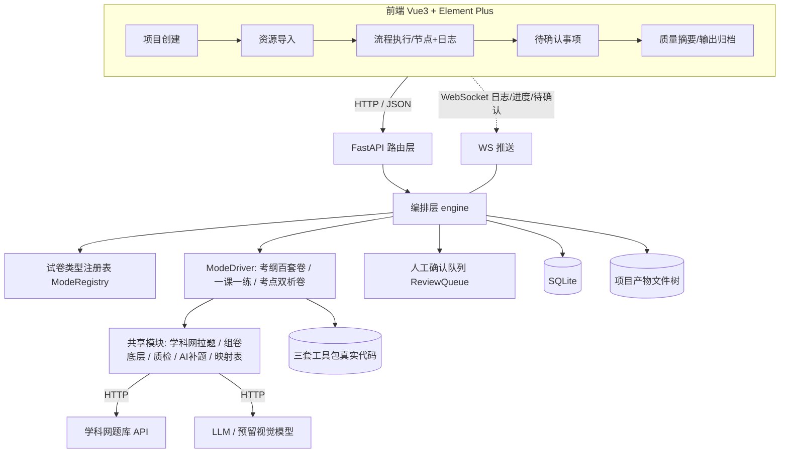
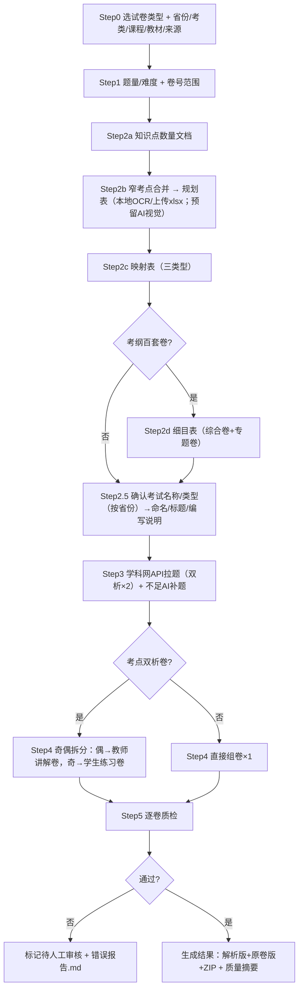
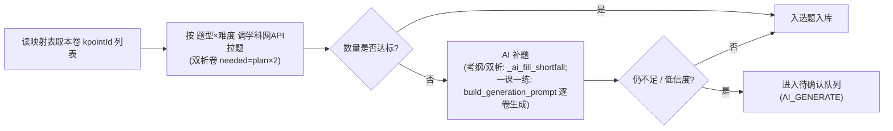

# 出卷集成工作台（Exam Production Studio）— 设计文档

> **项目代号**：Exam Production Studio（出卷集成工作台）
>
> **目标**：把现有三套零散试卷生成工具（考纲百套卷 / 考点双析卷 / 一课一练）整合为**一条统一流程 + 一个可视化操作界面**，复用其真实功能代码，改造路径与变量使之串联。
>
> **文档版本**：v1.0 | **日期**：2026-06-30

---

## 目录

1. [系统架构概览](#1-系统架构概览)
2. [试卷类型抽象与配置](#2-试卷类型抽象与配置)
3. [统一生成流程设计](#3-统一生成流程设计)
4. [数据与产物模型](#4-数据与产物模型)
5. [API 接口设计](#5-api-接口设计)
6. [后端模块设计](#6-后端模块设计)
7. [前端页面设计](#7-前端页面设计)
8. [设置项 → UI 控件 → 后端字段映射](#8-设置项--ui-控件--后端字段映射)
9. [整合改造点（复用与去硬编码）](#9-整合改造点复用与去硬编码)
10. [开发与部署](#10-开发与部署)
11. [附录 A：前端字段级 UI 规格](#11-附录-a前端字段级-ui-规格)
12. [附录 B：三类型驱动详细调用链](#12-附录-b三类型驱动详细调用链)

---

## 1. 系统架构概览

### 1.1 技术栈

| 层级 | 技术选型 |
|------|----------|
| 后端 | Python 3.10+ / FastAPI（异步）+ Uvicorn |
| 编排 | 自研编排层 engine（ModeDriver + 流程节点 + 人工确认队列） |
| 工具复用 | 三套现有工具包（考纲百套卷 / 一课一练 / 考点双析卷）的真实模块 |
| 实时通信 | WebSocket（执行日志、进度、待确认事件推送） |
| 存储 | SQLite（任务/项目元数据） + 磁盘（按项目的产物文件树） |
| 前端 | Vue 3 + Element Plus + Vite + TypeScript + Pinia |
| 外部依赖 | 学科网题库 API、LLM（OpenAI 兼容接口）、（预留）视觉大模型 |

### 1.2 选型理由

- **后端用 Python**：三套工具全部是 Python（docx 生成、学科网拉题、质检、规划表 OCR），整合层在进程内/子进程直接复用这些模块，零跨语言成本。
- **FastAPI**：异步 + 原生 WebSocket，适合"长任务 + 实时日志 + 人工确认暂停"的交互；Pydantic 做请求校验。
- **前端用 Vue 3 + Element Plus**：本质是"向导式内部工具"，Element Plus 内置 `Steps / Form / Table / Upload / Descriptions / Progress` 等组件，正好覆盖项目创建、流程节点、待确认队列、质量摘要等页面；Vite 开发热更新快。
- **SQLite + 磁盘**：单机/小团队工具，免运维；产物（docx/xlsx/报告）天然是文件，元数据进 SQLite 便于检索与状态机管理。

> 说明：原 `examforge` 仅为一次性 demo，其架构/实现不作参考；本平台为全新设计。

### 1.3 整体架构



### 1.4 任务处理流程（含人工确认暂停）

```
前端发起"开始/继续"流程
   │
FastAPI 路由 → 编排层 runner（按试卷类型取 ModeDriver）
   │
逐节点执行（知识点数量 → 规划表 → 映射表 → [细目表] → 确认命名 → 拉题+AI补题 → [分卷] → 质检）
   │
每个节点：调用对应工具模块（子线程/子进程）→ WebSocket 推送日志/进度
   │
遇到人工确认点（低信度映射 / AI补题 / 规则冲突 / 质检不通过）
   │  ├── 写入 review_items（status=pending）+ 暂停该卷
   │  └── WebSocket 推送"待确认"事件 → 前端待确认队列
   │
人工"确认并继续" → 节点继续；"退回重算" → 回退到指定节点重跑
   │
全部完成 → 生成结果（解析版/原卷版/ZIP）+ 质量摘要 + （如有）错误报告
```

### 1.5 目录结构（提案，可后续调整）

```
exam_production_studio/
├── backend/
│   ├── main.py                  # FastAPI 入口
│   ├── config.py                # 配置/密钥加载（env + 密钥文件）
│   ├── db.py                    # SQLite 连接与建表
│   ├── routers/                 # projects / resources / flow / review / qc / artifacts / settings / ws
│   ├── engine/
│   │   ├── context.py           # ProjectContext（业务变量 + 路径解析）
│   │   ├── registry.py          # 试卷类型注册表与每类型配置
│   │   ├── runner.py            # 流程编排（节点调度 + 暂停/恢复/回退）
│   │   ├── review.py            # 人工确认队列
│   │   ├── drivers/             # base.py / kaogang.py / yikeyilian.py / shuangxi.py
│   │   └── steps/               # kpoint_count / planning / mapping / mesh / naming / pull / assemble / split / qc
│   ├── shared/                  # 从三套工具抽取的共享模块（去硬编码后）
│   │   ├── xueke_api/           # 学科网拉题（query_questions / api_pull_core / kpoint_resolver）
│   │   ├── docx/                # 组卷底层（docx_utils1 / docx_generation）
│   │   ├── qc/                  # 质检 rules / quality / report
│   │   ├── ai/                  # LLM 调用 / AI 补题 / 映射表生成
│   │   └── ocr/                 # 教材目录本地 OCR（+ 预留视觉接口）
│   └── toolkits/                # 三套工具包（保持目录，按需 import；逐步迁移到 shared/）
├── frontend/                    # Vue3 + Element Plus + Vite
│   └── src/{views,components,services,stores,router}
├── data/
│   ├── studio.db                # SQLite
│   └── projects/{project_id}/   # 每项目产物树（见 §4.2）
├── configs/                     # 每试卷类型的模板/编写规范/题型定义
│   ├── kaogang_100/  ├── shuangxi/  └── yikeyilian/
└── .env.example                 # 环境变量样例（不含真实密钥）
```

---

## 2. 试卷类型抽象与配置

三种试卷**流程主干相同**，差异收敛到"试卷类型配置 + 类型驱动(ModeDriver)"。

### 2.1 类型标识

| 试卷类型 | 标识(type) | 规划表基础 | 题量 | 细目表 | 分卷 |
|----------|-----------|-----------|------|--------|------|
| 考纲百套卷 | `kaogang_100` | 考纲 | 大 | 有(综合卷+专题卷) | 无 |
| 考点双析卷 | `shuangxi` | 考纲 | 大(拉 2×) | 无 | 有(奇偶) |
| 一课一练 | `yikeyilian` | 教材目录 | 小 | 无 | 无 |

### 2.2 差异点矩阵

| 维度 | 考纲百套卷 | 考点双析卷 | 一课一练 |
|------|-----------|-----------|----------|
| 知识点数量文档 | 读考纲 + 学科网题量统计 | 同左 | 教材目录扫描（学科网题量在映射后按 kpointId 获取） |
| 规划表格式 | 10 列（模块/专题/考点/卷号 F/H/J） | 同考纲式 | 8 列（序号/考纲知识点/试卷主题/级别/题型/难度/套数/考纲标号） |
| 映射表 | 有 | 有 | 有（教材主题→kpointId） |
| 细目表 | 有 | 无 | 无 |
| 出题 | 学科网拉题 + 不足 AI 补题 | 学科网拉题 **×2** + AI 补题 | 学科网拉题 + AI 补题（AI 补题复用其逐卷生成） |
| 组卷/分卷 | ×1 直接组卷 | 偶→教师讲解卷、奇→学生练习卷 | ×1 直接组卷 |
| 命名 | `第N卷 … 考纲百套卷（解析版/原卷版）` | `第N卷 {试卷名} {后缀}（解析版/原卷版）` | `第N练 {主题} {省份}（{考试类型}）《教材》（版次） 一课一练（解析版）` |
| 标题/页眉页脚/首部 | 考纲百套卷模板 | 双析卷模板 | 一课一练模板 |
| 流程节点（用户视图） | 读取资料→解析考纲→生成规划→知识点匹配→**细目表**→拉题与补题→质检导出 | 读取资料→解析考纲→生成规划→知识点匹配→拉题与补题→**奇偶分卷**→质检导出 | 读取资料→解析目录→生成规划→知识点匹配→拉题与补题→质检导出 |

> 命名说明：上表命名为示意，**最终以各类型模板/编写规范为准**。例如一课一练实际文件名为 `第N练 {主题} {省份}（{考试类型}）《教材》（版次） 一课一练 （解析版）.docx`（注意"一课一练"与"（解析版）"之间含一个空格）。

### 2.3 类型配置（`configs/{type}/`）

每类型一个配置目录，包含：

- `config.json`：默认题量(`volume_config`)、命名模板、是否需细目表/分卷、拉题倍率。
- `编写规范.md`：出题与质检规范（AI 补题 prompt 依据）。
- `templates/template.docx`：页眉页脚/样式模板。
- （一课一练额外）`题型定义/*.json`：按考类的题型与重要度配置。

```jsonc
// configs/shuangxi/config.json（示例）
{
  "type": "shuangxi",
  "display_name": "考点双析卷",
  "plan_base": "syllabus",          // syllabus | textbook
  "need_mapping": true,
  "need_mesh": false,
  "need_split": true,
  "pull_multiplier": 2,
  "name_template": "第{vol}卷 {exam_name} {suffix}（{variant}）",
  "default_volume_config": { "by_type": { "单选题": {"count": 20, "score_per": 2}, "...": {} }, "difficulty": {"easy":80,"medium":10,"hard":10} }
}
```

---

## 3. 统一生成流程设计

### 3.1 流程总览



### 3.2 各步骤说明

| 步骤 | 动作 | 复用模块 | 产物 |
|------|------|----------|------|
| Step0 | 选类型 + 录入业务变量 + 选来源 | — | `projects` 记录 |
| Step1 | 题量/难度/窄考点合并 + **卷号范围**（`all`/`1-5`/`3,7,12`，沿用一课一练 `_parse_generation_range`） | — | `volume_config` / `paper_range` |
| Step2a | 知识点数量文档 | `kpoint_type_summary`（考纲/双析）；`textbook_toc_scanner`（一课一练） | `知识点数量/*.md`、`教材目录扫描/*.md` |
| Step2b | 窄考点合并(合计<80，主要用于考纲/双析)→规划表（**本地OCR/上传xlsx**） | 一课一练 `规划表/generate_plan`；考纲规划表生成 | `生产规划/{规划表}.xlsx` |
| Step2c | 映射表（考点/主题→kpointId） | `generate_mapping` + `kpoint_resolver` | `生产规划/{映射表}.xlsx` |
| Step2d | 细目表（仅考纲） | `generate_mesh` | `专题训练卷_*.docx` / `课程综合卷_*.docx` |
| Step2.5 | 确认考试名称/类型（按省份） | 一课一练 `_ask_exam_type_name`；考纲 `exam_table_title/exam_type` | 写入 `exam_type_name`、回写规划表 |
| Step3 | 学科网拉题(双析×2)+不足AI补题 | `query_questions`+`api_pull_core`；`_ai_fill_shortfall`（一课一练补题复用 `build_generation_prompt`） | `_临时/API原始结果/*`、`组卷待质检/*.docx` |
| Step4 | 组卷/分卷 | `docx_generation`+`docx_utils1`；`process_exam`（双析奇偶拆分） | `生成结果/*.docx` |
| Step5 | 逐卷质检 | `质检/rules`（考纲/双析）/`quality`（一课一练） | `质检报告/*.md`、`错误报告.md` |

> 注：**知识点数量文档 / 确认命名** 为内部步骤，被并入用户视图的"解析考纲/解析目录"等节点；**考试名称/类型**在「项目创建页」录入默认值，`naming` 步骤仅把它写入规划表与文件名，必要时可在创建页或流程中调整（故流程节点未单列"确认命名"）。

### 3.3 出题（Step3）细化：拉题 + AI 补题

三类型统一为"**学科网拉题为主，不足 AI 补题**"，不再有"纯 AI 生成"的独立分支：



### 3.4 分卷（Step4，仅考点双析卷）

从 2× 题量中按题号奇偶拆为两套，每套各出"解析版 + 原卷版"，共 4 份 docx：

```
教师讲解卷 = 第 (seq*2-1) 卷 ← 偶数题
学生练习卷 = 第 (seq*2)   卷 ← 奇数题
```

> 现有 `process_exam.py` 为"奇→教师、偶→学生"，整合时**翻转**为"偶→教师讲解卷、奇→学生练习卷"。

### 3.5 贯穿全流程：人工确认点（待确认队列）

流程不是一路跑到底，在以下节点会**暂停**并写入 `review_items`，等人工处理后再继续：

| 触发 | 类型 | 处理选项 |
|------|------|----------|
| 知识点匹配/映射表信度 < 阈值（默认 0.85） | `AI_MATCH` | 确认并继续 / 退回重算 / 查看原文 |
| 拉题不足需 AI 补题 | `AI_GENERATE` | 采用 AI 题 / 退回重算 |
| 规划表题型结构异常等 | `RULE_CONFLICT` | 确认配置 / 退回上一步 |
| 质检不通过（修复 N 轮仍有硬伤） | `QC_FAIL` | 人工审核通过 / 退回重算 |

### 3.6 状态机

```
project.status: draft → ready → running → review → done / failed
paper.status:   pending → planned → pulled →(splitted)→ qc_passed / pending_review
review_item.status: pending → confirmed / returned
```

---

## 4. 数据与产物模型

### 4.1 SQLite 表

#### projects — 项目（任务）
| 字段 | 类型 | 说明 |
|------|------|------|
| id | TEXT PK | 项目 ID |
| name | TEXT | 项目名 |
| paper_type | TEXT | `kaogang_100`/`shuangxi`/`yikeyilian` |
| province | TEXT | 省份全称（如 内蒙古自治区） |
| exam_category | TEXT | 考类/专业类别 |
| course | TEXT | 课程名 |
| textbook | TEXT | 教材名称 |
| edition | TEXT | 出版社·版次 |
| exam_type_name | TEXT | 考试名称/类型（高职分类考试/对口招生/自定义） |
| name_template | TEXT | 产品名模板（命名规则，可预览） |
| volume_config | TEXT(JSON) | 题型/题量/分值/难度/窄考点合并 |
| paper_range | TEXT | 卷号范围（`all`/`1-5`/`3,7,12`） |
| plan_source | TEXT | `ocr` / `upload` / `ai_vision`(预留) |
| output_versions | TEXT(JSON) | `["原卷版","解析版"]` |
| ai_options | TEXT(JSON) | 是否允许匹配/摘要/补题、信度阈值、修复轮数 |
| status | TEXT | draft/ready/running/review/done/failed |
| created_at / updated_at | TEXT | 时间 |

#### resources — 导入资源
| 字段 | 类型 | 说明 |
|------|------|------|
| id | TEXT PK | |
| project_id | TEXT FK | |
| kind | TEXT | `考纲`/`教材`/`真题`/`模板`/`规划表` |
| filename / path | TEXT | 原名 / 落盘路径 |
| status | TEXT | imported/missing/invalid |

#### papers — 卷
| 字段 | 类型 | 说明 |
|------|------|------|
| id / project_id | TEXT | |
| paper_no | INT | 卷/练 序号 |
| paper_type | TEXT | 考点训练卷/专题训练卷/课程综合卷/教师讲解卷/学生练习卷/一课一练 |
| module/topic/point_name | TEXT | 规划表来源字段 |
| status | TEXT | pending/planned/pulled/splitted/qc_passed/pending_review |
| docx_paths | TEXT(JSON) | 解析版/原卷版路径 |
| qc_report_path | TEXT | |

#### runs / flow_logs / review_items / quality_summary / settings
| 表 | 关键字段 |
|----|----------|
| runs | id, project_id, status, current_node, progress, started_at, finished_at |
| flow_logs | id, project_id, run_id, node, level, message, created_at |
| review_items | id, project_id, run_id, node, type(AI_MATCH/AI_GENERATE/RULE_CONFLICT/QC_FAIL), paper_no, confidence, payload(JSON), status, created_at |
| quality_summary | id, project_id, paper_no, score, adopted, ai_filled, manual_confirmed, format_ok, completeness, coverage, ai_risk, suggestion |
| settings | key, value（全局 LLM/学科网/视觉模型配置） |

### 4.2 每项目产物树（磁盘）

```
data/projects/{project_id}/
├── 03_输入/            考纲.pdf | 教材/*.pdf | 真题/ | 模板.docx
└── 04_生成输出/
    ├── 知识点数量/      {课程}_知识点题目数量.md
    ├── 教材目录扫描/    _教材目录扫描结果.md（一课一练）
    ├── 生产规划/        {规划表}.xlsx | {映射表}.xlsx | [细目表/*.docx]
    ├── _临时/API原始结果/{卷}/...      拉题原始 + 候选/入选
    ├── 组卷待质检/      {卷}.docx
    ├── 质检报告/        {卷}_质检报告.md
    ├── 生成结果/        {成品}.docx | 原卷版 | ZIP | 错误报告.md
    └── 运行记录/        {卷}_运行记录.json
```

---

## 5. API 接口设计

统一前缀 `/api`，统一响应 `{ "code": 0, "message": "ok", "data": {...} }`。

### 5.1 项目与资源
| 方法 | 路径 | 说明 |
|------|------|------|
| GET | `/api/projects` | 项目列表 |
| POST | `/api/projects` | 创建项目（全部业务变量一次性提交） |
| GET | `/api/projects/{id}` | 项目详情 |
| PUT | `/api/projects/{id}` | 更新业务变量/题量/范围 |
| DELETE | `/api/projects/{id}` | 删除 |
| GET | `/api/projects/{id}/name-preview` | 产品名模板预览（按当前字段拼） |
| POST | `/api/projects/{id}/resources` | 上传资源（考纲/教材/真题/模板/规划表 xlsx） |
| GET | `/api/projects/{id}/resources` | 资源与导入状态 |

### 5.2 流程执行
| 方法 | 路径 | 说明 |
|------|------|------|
| GET | `/api/projects/{id}/flow` | 流程节点状态 + 进度 + 当前节点 |
| POST | `/api/projects/{id}/flow/start` | 开始（按 paper_range 调度） |
| POST | `/api/projects/{id}/flow/pause` | 暂停 |
| POST | `/api/projects/{id}/flow/resume` | 继续 |
| POST | `/api/projects/{id}/flow/rerun` | 回退重跑（body: `{node, paper_no?}`） |
| GET | `/api/projects/{id}/flow/logs` | 历史日志 |

### 5.3 待确认队列
| 方法 | 路径 | 说明 |
|------|------|------|
| GET | `/api/projects/{id}/reviews` | 待确认列表（含详情：输入依据/AI建议/候选/采用后流程） |
| POST | `/api/projects/{id}/reviews/{rid}/confirm` | 确认并继续（body: 采用的候选/选项） |
| POST | `/api/projects/{id}/reviews/{rid}/return` | 退回重算 |

### 5.4 质检/质量摘要/产物
| 方法 | 路径 | 说明 |
|------|------|------|
| GET | `/api/projects/{id}/quality` | 质量摘要（评分/采用数/补题数/覆盖率…） |
| GET | `/api/projects/{id}/qc/reports` | 待人工审核卷列表 |
| GET | `/api/projects/{id}/qc/reports/{paper_no}` | 单卷错误报告(Markdown) |
| GET | `/api/projects/{id}/artifacts` | 输出归档（成品/原卷/ZIP/报告，下载链接） |

### 5.5 全局设置
| 方法 | 路径 | 说明 |
|------|------|------|
| GET/PUT | `/api/settings` | LLM（key/base_url/model）、学科网（cookie/app_key/sign）、视觉模型（预留）、信度阈值、修复轮数 |

### 5.6 WebSocket
- `WS /ws/projects/{id}`：服务端推送 `{event: log|progress|review|done, node, message, time, ...}`；客户端 `ping`/`pong` 保活。

---

## 6. 后端模块设计

### 6.1 ProjectContext（业务变量 + 路径解析，去硬编码核心）

所有工具步骤**只接收 `ProjectContext`**，不再读写硬编码路径/省份。

```python
@dataclass
class ProjectContext:
    project_id: str
    paper_type: str            # kaogang_100 | shuangxi | yikeyilian
    province: str              # 全称
    exam_category: str
    course: str
    textbook: str
    edition: str
    exam_type_name: str
    volume_config: dict
    paper_range: str           # "1-5,7"
    plan_source: str           # ocr | upload | ai_vision
    output_versions: list[str]
    root: Path                 # data/projects/{id}

    def dir(self, name: str) -> Path:        # 标准输出子目录
        return self.root / "04_生成输出" / name
    def pull_multiplier(self) -> int:
        return 2 if self.paper_type == "shuangxi" else 1
    def selected_papers(self) -> list[int]:  # 解析 paper_range
        return parse_range(self.paper_range)
```

### 6.2 ModeRegistry / 类型配置

```python
registry.get("shuangxi") -> ModeConfig(need_mapping=True, need_mesh=False,
                                        need_split=True, pull_multiplier=2,
                                        name_template=..., template_docx=..., spec_md=...)
```

### 6.3 ModeDriver 接口（类型驱动）

```python
class ModeDriver(Protocol):
    type: str
    flow_nodes: list[str]                          # 用户视图节点（按类型增减）

    def kpoint_count(self, ctx) -> Path: ...
    def gen_planning(self, ctx, source: str) -> Path: ...   # ocr | upload
    def gen_mapping(self, ctx) -> Path: ...
    def gen_mesh(self, ctx) -> list[Path] | None: ...       # 仅考纲百套卷
    def confirm_naming(self, ctx, exam_info: dict) -> None: ...
    def produce_questions(self, ctx, paper_no: int) -> PaperQuestions: ...  # 拉题+AI补题
    def assemble(self, ctx, paper_no, qs) -> list[Path]: ... # 双析→分卷4份；其他→1份
    def qc(self, ctx, paper_no) -> QCResult: ...
```

三个实现：
- `KaogangDriver`：包装 `考纲百套卷/01_工具脚本/生成器/runner.py` 的各阶段函数；含细目表。
- `YikeyilianDriver`：包装 `一课一练工具包/.../runner.py`；新增 `gen_mapping`（教材主题→kpointId），出题改走共享学科网拉题，AI 补题复用其 `build_generation_prompt`。
- `ShuangxiDriver`：规划表/映射表/拉题借用考纲方式（共享模块），`assemble` 调 `考点双析卷工具包/scripts/process_exam.py` 的奇偶拆分。

### 6.4 出题（拉题 + AI 补题）

```python
def produce_questions(ctx, paper_no):
    plan = load_paper_plan(ctx, paper_no)
    needed = scale(plan, ctx.pull_multiplier())          # 双析 ×2
    pulled = xueke_api.pull_for_plan(ctx, plan, needed)  # 共享：query_questions + api_pull_core
    filled = []
    if shortfall(pulled, needed):
        filled = ai_fill(ctx, plan, shortfall)           # 类型可注入：考纲/双析→_ai_fill_shortfall；一课一练→build_generation_prompt
        if still_short(filled): enqueue_review(ctx, paper_no, "AI_GENERATE")
    return assemble_questions(pulled + filled)
```

> 命名提示：上方 `assemble_questions`（把拉到的题组装为"试卷题目集"）与 `ModeDriver.assemble`（组卷/分卷输出 docx）含义不同，实现时建议把前者改名为 `build_question_set`，避免混淆。

### 6.5 共享模块（`backend/shared/`）

| 子模块 | 来源 | 去硬编码改造 |
|--------|------|--------------|
| `xueke_api/` | 考纲百套卷 `学科网API拉题移植版`（`query_questions`/`api_pull_core`/`kpoint_resolver`） | BASE→项目树；cookie/app_key/sign 从 settings；修复失效 import |
| `docx/` | `docx_utils1`/`docx_generation` | 命名/页眉页脚/标题改为按 `ctx` + 类型模板；移除"考纲百套卷"写死后缀 |
| `qc/` | `质检/rules`、`quality`、`report` | 接收 `ctx`；报告写入项目树 |
| `ai/` | `config_io.call_api`、`prompts`、`generate_mapping` | key/base_url/model 从 settings；省份/考类参数化 |
| `ocr/` | `textbook_toc_scanner` | 路径参数化；**预留视觉接口** `vision_ocr(images)`（未实现，配置开关） |

### 6.6 配置与密钥

- 业务变量 → `projects` 表（前端表单）。
- 全局凭据（LLM key/base_url/model、学科网 cookie/app_key/sign、视觉模型）→ `settings` 表 + `.env`，**源码不留明文**；`config.py` 统一加载。

---

## 7. 前端页面设计

### 7.1 布局与导航（参考 UI 稿）

- 顶部品牌：**出卷集成工作台 / Exam Production Studio**。
- 左侧导航：**产品系列**（一课一练 / 考纲百套卷 / 考点双析卷）+ **工作区**（项目创建 / 资源导入 / 流程执行 / 待确认事项 / 输出归档）。
- 技术：Vue 3 `<script setup lang="ts">` + Element Plus + Pinia + 统一 `services/api.ts`（axios）+ `useWebSocket`。

### 7.2 页面清单

| 页面 | 路由 | 内容 | 关键 API |
|------|------|------|----------|
| 项目创建 | `/projects/new` | 卷类产品3卡片 + 业务变量表单 + 产品名模板预览 + 资源导入 + 任务预览 | `POST /projects`、`/name-preview`、`/resources` |
| 资源导入 | `/projects/:id/resources` | 考纲/教材/真题/模板/规划表 上传与状态 | `/resources` |
| 流程执行 | `/projects/:id/flow` | 横向流程节点 + 实时日志 + 任务概况 + 回退；规划表来源选择(本地OCR/上传) | `/flow/*`、`WS` |
| 待确认事项 | `/projects/:id/reviews` | 待确认队列 + 确认详情(输入依据/AI建议/候选/采用后流程) + 确认并继续/退回重算 | `/reviews/*` |
| 质量摘要 | `/projects/:id/quality` | 评分卡 + 各项指标 + 交付建议 | `/quality` |
| 输出归档 | `/projects/:id/artifacts` | 成品/原卷/ZIP/报告 下载 | `/artifacts`、`/qc/*` |

### 7.3 关键交互
- **卷号范围**：输入框，支持 `all` / `1-5` / `3,7,12`，前端即时校验 + 预览"将生成 N 套"。
- **流程节点**：`el-steps`，按试卷类型动态增减（细目表/奇偶分卷节点）。
- **待确认**：`el-badge` 提示数量；点击查看详情后"确认并继续/退回重算"。
- **实时日志**：WebSocket 流式追加，终端风格。

---

## 8. 设置项 → UI 控件 → 后端字段映射

> 目标：**所有内容均可通过界面设置，无需手改文件/命令行**。下表逐项对应。

| # | 设置项 | UI 控件 | 后端字段 / 工具参数 | 默认/说明 |
|---|--------|---------|---------------------|-----------|
| 1 | 试卷类型 | 卡片单选 | `paper_type` | 决定流程分支 |
| 2 | 省份 | 下拉(可输入，全称) | `province` | 内蒙古自治区等不简写 |
| 3 | 考试名称/类型 | 下拉+自定义 | `exam_type_name` / `exam_table_title` | 高职分类考试/对口招生/自定义（Step2.5） |
| 4 | 考类/专业类别 | 下拉/输入 | `exam_category` | |
| 5 | 课程名 | 输入 | `course` | |
| 6 | 教材名称 | 输入 | `textbook` | |
| 7 | 出版社·版次 | 输入 | `edition` | 高教版·第3版 |
| 8 | **卷号范围** | 输入（`all`/`1-5`/`3,7,12`） | `paper_range` → `parse_range()` | 沿用一课一练 `--range` 语义 |
| 9 | 生产单位 | 下拉 | `production_unit` | 课本目录最小单元等 |
| 10 | 产品名模板 | 只读预览 | `name_template`（由 2–7 拼） | 命名规则 |
| 11 | 题型/题量/分值 | 表格(增删行) | `volume_config.by_type` | 按类型默认 |
| 12 | 难度分布 | 滑块/输入 | `volume_config.difficulty` | 80/10/10 |
| 13 | 窄考点合并 | 开关+阈值+减半通道 | `volume_config.narrow_point` | 合计<80 合并（主要用于考纲/双析） |
| 14 | 拉题倍率 | 只读(自动) | `pull_multiplier` | 双析=2，其余=1 |
| 15 | 规划表来源 | 单选(本地OCR/上传) | `plan_source` | 预留 AI 视觉 |
| 16 | 资源导入 | 上传 | `resources[]` | 考纲/教材/真题/模板/规划表 |
| 17 | 输出版本 | 多选 | `output_versions` | 原卷版/解析版 |
| 18 | AI 辅助 | 开关 | `ai_options.{match,summary,fill}` | 允许匹配/摘要/补题 |
| 19 | 知识点匹配信度阈值 | 数字 | `ai_options.match_threshold` | 0.85 |
| 20 | 质检修复轮数 | 数字 | `ai_options.max_fix_rounds` | 2 |
| 21 | LLM 凭据 | 设置页表单 | `settings.llm.*` | key/base_url/model |
| 22 | 学科网凭据 | 设置页表单 | `settings.xueke.*` | cookie/app_key/sign |
| 23 | 视觉模型(预留) | 设置页(禁用占位) | `settings.vision.*` | 后续启用 |
| 24 | 流程控制 | 按钮 | start/pause/resume/rerun | — |
| 25 | 待确认处理 | 按钮 | confirm/return | 确认并继续/退回重算 |

---

## 9. 整合改造点（复用与去硬编码）

### 9.1 共性改造
- **路径**：移除三套工具里的绝对路径（如 `C:\Users\zxxk\…`），统一走 `ProjectContext` 解析的项目树。
- **省份/考类**：移除写死的 `重庆市/电子信息类`、内蒙古/土建等一次性脚本里的常量，改为入参。
- **密钥**：LLM key、学科网 cookie/app_key/sign 从源码移到 `settings`/`.env`。
- **import**：修复失效导入（如 `学科网API拉题移植版.*`）。

### 9.2 按工具
| 工具 | 复用 | 改造/新增 |
|------|------|-----------|
| 考纲百套卷 | runner 各阶段、学科网拉题、组卷、质检、细目表/映射表 | 阶段函数参数化为 `ctx`；作为 `KaogangDriver` |
| 一课一练 | 教材目录扫描、规划表生成、docx、quality、AI 逐卷生成 | **新增映射表 + 接共享学科网拉题**；AI 生成降级为补题；作为 `YikeyilianDriver` |
| 考点双析卷 | `process_exam` 奇偶拆分 | 规划表/映射表/2×拉题借共享；奇偶映射翻转为"偶→教师/奇→学生"；作为 `ShuangxiDriver`；`scrape_audit`/`auto_fix` 降级为可选 |

---

## 10. 开发与部署

### 10.1 环境变量（`.env`）
| 变量 | 说明 |
|------|------|
| `LLM_API_KEY` / `LLM_BASE_URL` / `LLM_MODEL` | LLM 凭据 |
| `XKW_COOKIE` / `XKW_APP_KEY` / `XKW_SIGN` | 学科网凭据 |
| `VISION_*`（预留） | 视觉模型（暂不启用） |
| `STUDIO_DB` | SQLite 路径，默认 `data/studio.db` |

### 10.2 运行
```bash
# 后端
cd backend && pip install -r requirements.txt && uvicorn main:app --port 8000
# 前端
cd frontend && npm install && npm run dev   # 代理 /api、/ws → :8000
# 打包（可选）：PyInstaller 后端 + 前端 dist 静态托管
```

### 10.3 验证基线
- 三类型各跑通"创建项目→流程执行→（命中一次待确认）→质检→输出归档"。
- 卷号范围 `3,7,12` 仅生成 3 套；双析卷生成教师/学生各 2 份（解析版+原卷版）。
- 所有设置均经界面提交，无需手改文件。

### 10.4 范围与约定（备注）
- **命名以模板为准**：文档中的命名/标题为示意，最终以各类型 `templates/` 与编写规范为准。
- **文档锚点**：§8 标题含 `→` 等符号，部分 Markdown 渲染器据此生成的锚点可能与目录链接不完全一致，仅影响点击跳转，不影响内容。
- **本期未展开（实现阶段再定）**：① 鉴权——按内部单机工具，暂不设登录/权限；② 任务并发——建议每个项目同一时间仅允许 1 个 run，避免产物目录写冲突；③ 错误处理粒度、重试与超时——在编排层 `runner` 统一约定。

---

## 11. 附录 A：前端字段级 UI 规格

> 把 §8 的设置项落到每个页面的具体表单。控件类型对应 Element Plus 组件。所有项均可经界面设置，无需手改文件。

### 11.1 项目创建页（`/projects/new`）

| 字段 | 控件 | 必填 | 默认值 | 校验 / 联动 |
|------|------|------|--------|-------------|
| 项目名称 | `el-input` | 是 | 自动（类型+省份+课程） | 非空；可手改 |
| 卷类产品(试卷类型) | 卡片单选(`el-radio` 卡片) | 是 | 一课一练 | 三选一；**联动**：切换后刷新默认题量、命名模板、规划表基础(考纲/教材)、是否显示细目表/分卷节点 |
| 省份 | `el-select`(可输入) | 是 | — | 全称校验（自治区不简写，给提示）；联动命名/真题风格目录 |
| 考试名称/类型 | `el-select`+自定义 | 是 | 高职分类考试 | 选项：高职分类考试/对口招生/自定义；联动命名/标题 |
| 考类/专业类别 | `el-select`(可输入) | 是 | — | 联动题型定义(一课一练)、学科网考类映射 |
| 课程名 | `el-input` | 是 | — | 联动命名/知识点数量文档 |
| 教材名称 | `el-input` | 一课一练必填 | — | 形如《机械基础》 |
| 出版社·版次 | `el-input` | 一课一练必填 | — | 格式：简称·中文版次（如 高教版·第3版） |
| 生产范围(卷号范围) | `el-input` / "选择目录"弹窗 | 是 | all | 语法 `all`/`1-5`/`3,7,12`；实时预览"将生成 N 套" |
| 生产单位 | `el-select` | 是 | 课本目录最小单元 | — |
| 产品名模板 | 只读 `el-input`(预览) | — | 由上字段拼 | 字段变更实时刷新（调 `/name-preview`） |
| 题型/题量/分值 | 可增删行 `el-table` | 是 | 按类型默认 | 数值>0；提示合计分 |
| 难度分布 | 三 `el-slider`/`el-input-number` | 是 | 80/10/10 | 三者和=100 |
| 窄考点合并 | `el-switch`+阈值+减半通道开关 | — | 开/80/开 | 阈值默认 80 |
| 输出版本 | `el-checkbox-group` | 是 | 原卷版+解析版 | 至少选一 |
| AI 辅助 | 开关组(匹配/摘要/补题) | — | 全开 | — |
| 信度阈值 | `el-input-number`(0–1) | — | 0.85 | — |
| 质检修复轮数 | `el-input-number` | — | 2 | ≥0 |
| 操作 | 保存草稿 / 生成任务预览 | — | — | 预览→进入流程执行 |

### 11.2 资源导入页（`/projects/:id/resources`）

| 资源 | 控件 | 必填 | 校验/状态 |
|------|------|------|-----------|
| 考纲文件 | `el-upload`(pdf) | 考纲/双析必填；一课一练用于标号 | 已导入/缺失 |
| 教材 PDF | `el-upload`(pdf,多) | 一课一练必填 | 本地 OCR 来源 |
| 真题风格库 | `el-upload`/选择 | 可选 | 可选 |
| Word 模板 | `el-upload`(docx) | 可选 | 缺省用类型默认模板 |
| 规划表 xlsx | `el-upload`(xlsx) | 当来源=上传 时必填 | 列格式校验（考纲10列/一课一练8列）→ 通过/格式错误 |

### 11.3 流程执行页（`/projects/:id/flow`）

| 元素 | 控件 | 说明 |
|------|------|------|
| 流程节点 | `el-steps`(只读) | 按类型动态增减（细目表/奇偶分卷） |
| 规划表来源 | `el-radio`(本地OCR扫描/上传) | 默认按是否已上传 xlsx |
| 流程控制 | 按钮 开始/暂停/继续/重跑 | 重跑弹窗选节点+卷号 |
| 执行日志 | 只读终端区 | WebSocket 流式 |
| 任务概况 | `el-descriptions`/`el-progress`(只读) | 进度/已完成/待确认/技术错误/题库API/预计剩余 |

### 11.4 待确认事项页（`/projects/:id/reviews`）

| 元素 | 控件 | 说明 |
|------|------|------|
| 待确认队列 | 列表 + `el-tag`(AI_MATCH/AI_GENERATE/RULE_CONFLICT/QC_FAIL) | 含数量徽标 |
| 确认详情 | `el-descriptions`(只读) | 输入依据 / AI 建议 / 候选项 / 采用后流程 |
| 候选选择 | `el-radio`/`el-checkbox` | 选采用的候选知识点/AI题 |
| 操作 | 确认并继续 / 退回重算 / 查看原文 | 退回弹窗选回退节点 |

### 11.5 质量摘要页（`/projects/:id/quality`）
只读卡片：评分(/100)、题库采用数、AI补题数、人工确认数、格式校验、题量完整度、知识点覆盖、AI风险剩余、输出版本、交付建议；导出按钮。

### 11.6 输出归档页（`/projects/:id/artifacts`）
文件列表（解析版/原卷版/ZIP/质检报告/错误报告）+ 下载/打包按钮；错误报告 Markdown 预览。

### 11.7 全局设置页（`/settings`）

| 分组 | 字段 | 控件 |
|------|------|------|
| LLM | api_key / base_url / model / temperature / max_tokens | `el-input`(密码框 for key) |
| 学科网 | cookie / app_key / sign | `el-input`(textarea for cookie) |
| 视觉模型(预留) | enable / model / base_url / key | 占位(禁用) |
| 默认阈值 | 信度阈值 / 修复轮数 | `el-input-number` |

---

## 12. 附录 B：三类型驱动详细调用链

> 节点 → step → 复用的工具文件/函数 → 输入 → 输出。函数/文件名引用自三套真实工具，整合时统一改为接收 `ProjectContext`。

### 12.1 KaogangDriver（考纲百套卷，源 `考纲百套卷/01_工具脚本/`）

| 流程节点 | step | 复用文件/函数 | 输入 → 输出 |
|----------|------|---------------|-------------|
| 读取资料 | — | `生成器/config_io.load_config/load_spec`、`生成器/planning.parse_planning_table` | 配置/规范/规划表 → 内存 |
| 解析考纲/知识点数量 | `kpoint_count` | `学科网API拉题移植版/kpoint_type_summary.main` | 课程+学科网映射 → `知识点数量/*.md` |
| 生成规划 | `planning` | 规划表（人工/AI）+ `planning` 解析 | → `考点规划总表.xlsx` |
| 知识点匹配(映射表) | `mapping` | `generate_mapping` + `kpoint_resolver.build_kpoint_map/load_mapping_table` | 规划表 → `映射表.xlsx` |
| 细目表 | `mesh` | `generate_mesh` | 规划表 → `专题训练卷_*.docx`/`课程综合卷_*.docx` |
| 确认命名 | `naming` | `runner` 确认 `exam_table_title/exam_type` 回写 | → 规划表元信息 |
| 拉题与补题 | `pull` | `runner._api_pull_for_paper`(`query_questions`+`api_pull_core`+`kpoint_resolver`)；`apply_content_filter`(考点训练卷)；`_ai_fill_shortfall` | 映射表 kpointId → `组卷待质检/*.docx` + `_临时/API原始结果/*` |
| 质检导出 | `qc`/`assemble` | `paper_loader`→`paper_assembler.write_analysis_text`→`docx_generation.generate_docx`(`docx_utils1`)；`质检/rules.run_quality_checks`+`regenerator`；`postprocess._post_process` | → `生成结果/*.docx`(解析版+原卷版+ZIP)、`质检报告/*.md`、`错误收集.md` |

### 12.2 YikeyilianDriver（一课一练，源 `一课一练工具包（含示例）/…/01_工具脚本/`）

| 流程节点 | step | 复用文件/函数 | 输入 → 输出 |
|----------|------|---------------|-------------|
| 读取资料 | — | `生成器/config_io`、教材 PDF | 配置/规范 → 内存 |
| 解析目录 | `kpoint_count` | `规划表/textbook_toc_scanner`、`规划表/plan_modules/{textbook_toc,outline_parser,toc_matcher}` | 教材PDF → `教材目录扫描/*.md` + 结构化目录 |
| 生成规划 | `planning` | `规划表/generate_plan`(`plan_modules/topic_generator`+`excel_writer`) | 目录+考纲 → `一课一练考点规划表.xlsx`(8列) |
| 知识点匹配(映射表)**新增** | `mapping` | **共享** `generate_mapping`+`kpoint_resolver` | 教材主题/考纲标号 → `映射表.xlsx` |
| 确认命名 | `naming` | `生成器/runner._ask_exam_type_name` | → `meta.exam_type_name` |
| 拉题与补题 | `pull` | **共享** `xueke_api.pull_for_plan`；不足→`生成器/prompts.build_generation_prompt`(原纯AI逐卷生成，降级为补题) | 映射表 → 入选题 |
| 质检导出 | `qc`/`assemble` | `生成器/docx_generation.generate_docx`(`docx_utils1`)；`生成器/quality._quick_check/_repair_qc_issues_targeted`；`runner._append_manual_review_report`；`postprocess` | → `第N练 …（解析版/原卷版）`、`质检报告.md` |

### 12.3 ShuangxiDriver（考点双析卷，源 `考点双析卷工具包/scripts/` + 借考纲共享）

| 流程节点 | step | 复用文件/函数 | 输入 → 输出 |
|----------|------|---------------|-------------|
| 读取资料 | — | 借考纲 `config_io`/`planning` | 配置/规划表 |
| 解析考纲/知识点数量 | `kpoint_count` | 借共享 `kpoint_type_summary` | → `知识点数量/*.md` |
| 生成规划 | `planning` | 借考纲式规划表生成 | → `规划表.xlsx` |
| 知识点匹配(映射表) | `mapping` | 共享 `generate_mapping`+`kpoint_resolver` | → `映射表.xlsx` |
| 拉题与补题(**×2**) | `pull` | 共享 `xueke_api.pull_for_plan`（`needed=plan×2`）；`_ai_fill_shortfall` | → 2× 题量入选题 |
| 奇偶分卷 | `split` | `考点双析卷工具包/scripts/process_exam.py`：`analyze`/`build`/`process_row`（**翻转**：偶→教师讲解卷、奇→学生练习卷；教师卷号=seq×2-1、学生卷号=seq×2） | → 4 份：教师/学生 ×（解析版+原卷版） |
| 质检导出 | `qc` | 共享 `质检/rules`；（可选）`scrape_audit`/`auto_fix_errors` 人工辅助 | → `质检报告/*.md`、`错误报告.md` |

> 说明：双析卷的"奇偶分卷"是其唯一类型专属逻辑；规划表/映射表/拉题全部复用考纲共享实现，仅 `needed` 乘以 2。

---

_文档版本 v1.0 · 2026-06-30 · 与《实现步骤文档》配套使用_
